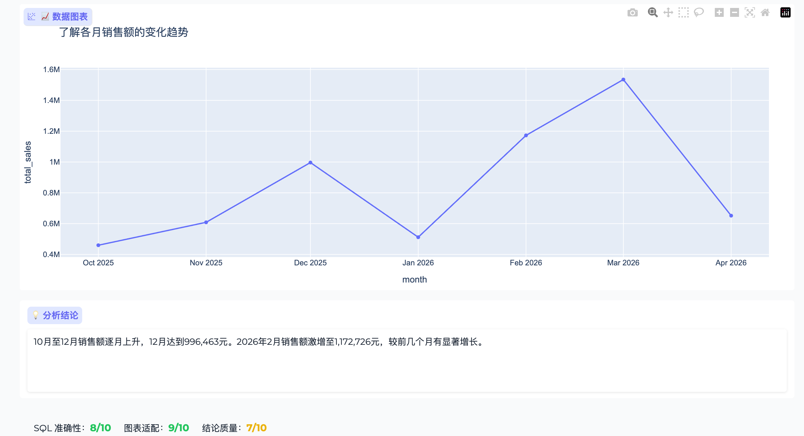

# sql-agent-kit

**生产级 Text-to-SQL Agent 工具包** — 让自然语言直接查询你的数据库，支持多 Agent 智能分析流程。

作者联系邮箱：ly956501819@foxmail.com
作者联系微信：ly956501819

<video src='https://github.com/user-attachments/assets/53503102-c8ab-4dd0-aa3b-38383ea60be2
' 
       controls='controls' 
       width='100%'>
    抱歉，您的浏览器不支持内嵌视频。
</video>


> 输入"上个月各商品的销售趋势如何？"，多 Agent 流水线自动完成意图拆解 → SQL 生成 → 图表渲染 → 结论分析 → 质量评估。

---

## ✨ 核心特性

### 基础能力

| 特性 | 说明 |
|------|------|
| 🛡️ 表名白名单 | 只允许查询指定的表，防止越权访问 |
| 🏷️ 语义注释层 | 给字段加业务含义，解决企业数据库字段名模糊问题 |
| 🔒 SQL 安全校验 | 只允许 SELECT，过滤所有写操作 |
| 🔄 错误自愈重试 | 执行失败自动把错误反馈给 LLM 重试（最多 N 次） |
| 📊 置信度评估 | 低置信度时提示用户确认，不静默执行 |
| 📚 Few-shot 管理 | 持续积累正确示例，提升准确率 |
| 📋 查询日志 | 完整记录每次查询，支持关键词搜索与删除 |
| 🌐 Web 配置界面 | 无需手动编辑文件，网页端完成所有配置 |

### 多 Agent 智能分析

| 特性 | 说明 |
|------|------|
| 🔍 Planner Agent | 拆解用户意图，智能判断图表类型，支持多子问题 |
| 💬 SQL Agent | 基于 ReAct 链路生成并执行 SQL，带错误自愈重试 |
| 📈 Chart Agent | 规则推断 + Planner 建议双层选型，自动生成 Plotly 交互图表 |
| 📝 Summary Agent | 基于数据结果输出 2-4 句中文分析结论 |
| 🏅 LLM-as-Judge | 三维度（SQL 准确性 / 图表适配 / 结论质量）0-10 分评估 |
| 🔄 思考过程面板 | 实时流式展示每个 Agent 的决策日志，全流程透明可审计 |

---

## 🗄️ 支持的数据库

- MySQL
- PostgreSQL
- SQLite

## 🤖 支持的 LLM

- OpenAI（及所有兼容接口，如 Ollama、vLLM）
- 通义千问（阿里云 DashScope）
- 硅基流动 SiliconFlow（Qwen、DeepSeek、GLM 等开源模型）
- 阿里云百炼平台

---

## 🚀 快速开始

### 环境要求

- Python 3.10+
- Node.js 18+

### 方式一：一键启动（推荐）

```bash
# macOS / Linux
./start.sh

# Windows
start.bat
```

脚本会自动完成：检查环境 → 创建虚拟环境 → 安装 Python 依赖 → 安装前端依赖 → 构建前端 → 启动服务。

首次运行时，如果 `.env` 不存在，脚本会自动从 `.env.example` 复制一份并退出，填写配置后重新运行即可。

启动成功后访问 [http://localhost:8000](http://localhost:8000)。

> 自定义端口：`PORT=9000 ./start.sh`

---

### 方式二：开发模式（前后端分离，支持热更新）

```bash
./dev.sh
```

- 前端（Vite 热更新）：[http://localhost:5173](http://localhost:5173)
- 后端（uvicorn --reload）：[http://localhost:8000](http://localhost:8000)

Ctrl+C 同时停止两个进程。

---

### 方式三：手动启动

**1. 配置环境变量**

```bash
cp .env.example .env
```

编辑 `.env`，填入数据库连接信息和 LLM API Key：

```env
# 选择一个 LLM Provider 填写
SILICONFLOW_API_KEY=sk-xxx
# OPENAI_API_KEY=sk-xxx
# DASHSCOPE_API_KEY=sk-xxx

# 数据库配置
DB_TYPE=mysql
DB_HOST=127.0.0.1
DB_PORT=3306
DB_USER=root
DB_PASSWORD=your_password
DB_NAME=your_database
```

**2. 安装 Python 依赖**

```bash
python3 -m venv .venv
source .venv/bin/activate   # Windows: .venv\Scripts\activate
pip install -r requirements-backend.txt
```

**3. 构建前端**

```bash
cd frontend
npm install
npm run build
cd ..
```

**4. 启动后端**

```bash
uvicorn backend.main:app --host 0.0.0.0 --port 8000 --reload
```

访问 [http://localhost:8000](http://localhost:8000)。

---

## 🌐 Web UI 功能

### 💬 单 Agent 查询

输入自然语言，直接生成并执行 SQL，展示结果表格与置信度。适合快速、单次查询场景。

### 🧠 多 Agent 智能分析

完整的多 Agent 分析流水线，适合需要可视化图表和数据洞察的场景：

1. **Planner** 解析意图，拆解子问题，建议图表类型
2. **SQL Agent** 生成并执行 SQL（含错误自愈重试）
3. **Chart Agent** 自动生成 Plotly 交互图表（折线 / 面积 / 柱状 / 堆叠柱 / 饼图 / 散点 / 漏斗 / 热力图）
4. **Summary Agent** 生成 2-4 句中文分析结论
5. **LLM-as-Judge** 对 SQL 准确性、图表适配、结论质量打分

每次分析均同步记录到查询历史，支持后续溯源。

**思考过程面板** 实时流式展示每个 Agent 的执行情况：

```
🔍 [Planner Agent] 正在分析问题意图...
   ✅ 意图：分析各月销售趋势
   📊 建议图表：line
   📋 子问题（1 个）：各月销售额趋势如何？

💬 [SQL Agent] 准备执行 1 个查询...
   ✅ 子问题 1：各月销售额趋势如何？
   SQL：SELECT DATE_FORMAT(created_at,'%Y-%m') AS 月份, SUM(total_amount) ...
   置信度：90%，返回 7 行

📊 [Chart Agent] 正在判断图表类型...
   ✅ 图表类型：line（Planner 建议）

📝 [Summary Agent] 正在生成分析结论...
   ✅ 结论已生成（87 字）

🏅 [LLM-as-Judge] 正在评估输出质量...
   SQL 准确性：9/10  图表适配：9/10  结论质量：8/10
   📝 已记录到查询历史
```

### 其他管理页

| 页面 | 功能 |
|------|------|
| ⚙️ 配置管理 | 修改数据库连接和 LLM API Key，支持一键测试连接 |
| 📋 查询历史 | 查看所有历史记录（含智能分析图表），支持关键词搜索、单条删除、清空 |
| 🗂️ 表白名单 | 增删允许查询的表 |
| 🏷️ Schema 注释 | 编辑字段业务含义，支持 AI 自动生成注释 |
| 🔧 Agent 参数 | 调整重试次数、置信度阈值等行为参数 |
| 📚 Few-shot 管理 | 添加问题-SQL 示例对，持续提升准确率 |

---

## 📁 项目结构

```
sql-agent-kit/
├── start.sh / start.bat          # 一键启动脚本
├── dev.sh                        # 开发模式启动脚本（前后端分离）
├── backend/
│   ├── main.py                   # FastAPI 入口
│   ├── routers/                  # API 路由（query / analysis / history / config / ...）
│   ├── services/
│   │   ├── agent_service.py      # 线程安全单例 Agent
│   │   └── streaming.py          # SSE 流式推送（LangGraph 节点包装）
│   └── static/                   # 构建后的 Vue SPA（由 npm run build 生成）
├── frontend/
│   ├── src/
│   │   ├── views/                # 8 个页面（查询 / 分析 / 配置 / 历史 / ...）
│   │   ├── components/           # 公共组件（图表 / 结果表 / 评分 / ...）
│   │   └── api/index.js          # 所有 axios + EventSource 调用
│   └── vite.config.js
├── sql_agent/                    # 核心 Agent 包（不依赖 Web 层）
│   ├── single/                   # 单 Agent 主链路
│   │   ├── core.py              # SQLAgent 核心（ReAct 循环）
│   │   └── prompt_builder.py    # Prompt 构建
│   ├── multi/                    # 多 Agent 节点
│   │   ├── planner.py           # Planner Agent（意图拆解）
│   │   ├── sql_node.py          # SQL Agent 节点
│   │   ├── chart.py             # Chart Agent（规则推断 + Plotly）
│   │   ├── summary.py           # Summary Agent
│   │   ├── judge.py             # LLM-as-Judge 评估节点
│   │   └── state.py             # 多 Agent 共享状态
│   ├── graph/
│   │   └── pipeline.py          # LangGraph 编排流水线
│   ├── llm/                      # LLM 客户端（OpenAI / Qwen / SiliconFlow / Bailian）
│   ├── schema/                   # Schema 加载、注释、筛选
│   ├── executor/                 # SQL 执行器
│   ├── validator/                # 安全、语法、置信度校验
│   ├── fewshot/                  # Few-shot 存储与检索
│   └── feedback/                 # 查询日志与收集
├── data/
│   ├── tables.yaml               # 白名单表配置
│   └── schema_annotations.yaml  # 字段语义注释
├── config/
│   └── settings.yaml            # 全局参数配置
├── Dockerfile                    # Docker 镜像构建文件
├── .dockerignore                # Docker 构建排除文件
├── .env.example                  # 环境变量模板
└── requirements-backend.txt
```

---

## ⚙️ 配置说明

### 环境变量 (.env)

```env
# LLM Provider 选择（只需配置其中一个）
LLM_PROVIDER=siliconflow   # openai | qwen | siliconflow | bailian

# SiliconFlow 配置（推荐，性价比高）
SILICONFLOW_API_KEY=sk-xxx
SILICONFLOW_MODEL=Pro/zai-org/GLM-5.1   # 或 Qwen、DeepSeek 等模型

# OpenAI 配置
OPENAI_API_KEY=sk-xxx
OPENAI_BASE_URL=https://api.openai.com/v1
OPENAI_MODEL=gpt-4o

# 通义千问（DashScope）
DASHSCOPE_API_KEY=sk-xxx
QWEN_MODEL=qwen-plus

# 阿里云百炼
BAILIAN_API_KEY=sk-xxx
BAILIAN_MODEL=qwen-plus

# 数据库配置
DB_TYPE=mysql               # mysql | postgresql | sqlite
DB_HOST=127.0.0.1
DB_PORT=3306
DB_USER=root
DB_PASSWORD=your_password
DB_NAME=your_database

# Agent 参数
MAX_RETRY=3                 # SQL 执行失败最大重试次数
CONFIDENCE_THRESHOLD=0.6     # 低于此值时提示用户确认
LOG_PATH=./logs/queries.jsonl
```

### data/tables.yaml

白名单表配置，指定允许查询的表（只支持 SELECT）：

```yaml
allowed_tables:
  - orders          # 订单表
  - products        # 商品表
  - customers       # 客户表
```

### data/schema_annotations.yaml

给模糊的字段名加上业务含义，显著提升 LLM 生成 SQL 的准确率。支持在 Web UI 的「Schema 注释」页面手动编辑，或点击「🤖 自动生成注释」由 AI 根据表结构和样本数据自动生成。

```yaml
tables:
  orders:
    description: "订单主表，记录每一笔交易"
    columns:
      status: "订单状态：pending=待付款, paid=已付款, shipped=已发货, completed=已完成, cancelled=已取消"
      total_amount: "订单总金额，单位：元"
```

### config/settings.yaml

全局参数配置：

```yaml
llm:
  provider: siliconflow   # openai | qwen | siliconflow | bailian
  siliconflow:
    model: Qwen/Qwen2.5-72B-Instruct
    temperature: 0.0
    max_tokens: 2048

agent:
  max_retry: 3            # SQL 执行失败最大重试次数
  confidence_threshold: 0.6  # 低于此值时提示用户确认
  max_tables_in_prompt: 10   # 注入 Prompt 的最大表数

executor:
  query_timeout: 30       # SQL 查询超时（秒）
  max_rows: 500           # 单次查询最大返回行数

fewshot:
  store_path: ./data/fewshot.json  # Few-shot 存储路径
  top_k: 3                       # 检索返回的示例数量
```

---

## 💡 SDK 用法

### 单 Agent 模式

```python
from sql_agent import build_agent

agent = build_agent()
result = agent.query("上个月销售额最高的商品是什么？")

if result.success:
    print(result.sql)
    print(result.formatted_table)
elif result.need_confirm:
    print(f"置信度较低，请确认 SQL：\n{result.sql}")
else:
    print(f"查询失败：{result.error}")
```

### 多 Agent 模式

```python
from sql_agent import build_pipeline

pipeline = build_pipeline()
state = pipeline.invoke({"question": "各月销售额趋势如何？"})

print(state["sql_results"][0]["sql"])   # 生成的 SQL
print(state["summary"])                 # 分析结论
print(state["judge_scores"])            # {"sql_correctness": 9, "chart_fitness": 9, "summary_quality": 8}

for entry in state["process_log"]:
    print(entry)
```

---

## 🔄 多 Agent 流程图

```
用户问题
    │
    ▼
┌─────────────┐
│ Planner     │  意图拆解 → intent / chart_hint / sub_questions
└──────┬──────┘
       │
       ▼
┌─────────────┐
│ SQL Agent   │  ReAct 循环 → SQL 生成 → 安全校验 → 执行 → 自愈重试
└──────┬──────┘
       │ 成功          失败 → END
       ▼
┌─────────────┐
│ Chart Agent │  规则推断图表类型 → Plotly 交互图表
└──────┬──────┘
       │
       ▼
┌─────────────┐
│ Summary     │  数据摘要 + 意图 → 2-4 句中文结论
└──────┬──────┘
       │
       ▼
┌─────────────┐
│ LLM-as-Judge│  三维度评分 → 写入查询历史
└─────────────┘
```

---

## 🐳 Docker 部署

### 构建镜像

```bash
docker build -t sql-agent-kit .
```

### 运行容器

```bash
docker run -d \
  --name sql-agent-kit \
  -p 8000:8000 \
  -v $(pwd)/.env:/app/.env \
  -v $(pwd)/data:/app/data \
  -v $(pwd)/logs:/app/logs \
  sql-agent-kit
```

访问 [http://localhost:8000](http://localhost:8000)。

### 使用 SQLite

如果使用 SQLite 数据库，需要将数据库文件挂载到容器：

```bash
docker run -d \
  --name sql-agent-kit \
  -p 8000:8000 \
  -v $(pwd)/.env:/app/.env \
  -v $(pwd)/data:/app/data \
  -v $(pwd)/logs:/app/logs \
  -v $(pwd)/data/local.db:/app/data/local.db \
  sql-agent-kit
```

---

## 📄 License

MIT License — 自由使用、修改和分发。
