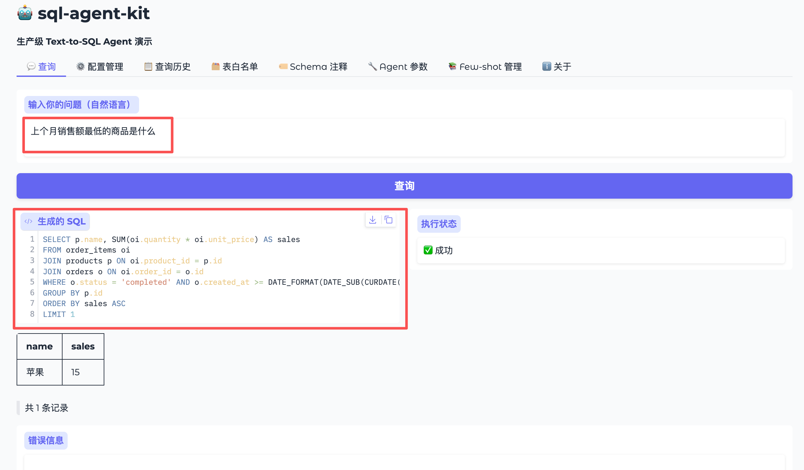

# sql-agent-kit

**生产级 Text-to-SQL Agent 工具包** — 让自然语言直接查询你的数据库，支持多 Agent 智能分析流程。
作者联系邮箱：ly956501819@foxmail.com
作者联系微信：ly956501819




> 输入"上个月各商品的销售趋势如何？"，多 Agent 流水线自动完成意图拆解 → SQL 生成 → 图表渲染 → 结论分析 → 质量评估。

---

## ✨ 核心特性

### 基础能力

| 特性 | 说明 |
|------|------|
| 🛡️ 表名白名单 | 只允许查询指定的表，防止越权访问 |
| 🏷️ 语义注释层 | 给字段加业务含义，解决企业数据库字段名模糊问题 |
| 🔒 SQL 安全校验 | 只允许 SELECT，过滤所有写操作 |
| 🔄 错误自愈重试 | 执行失败自动把错误反馈给 LLM 重试（最多 N 次） |
| 📊 置信度评估 | 低置信度时提示用户确认，不静默执行 |
| 📚 Few-shot 管理 | 持续积累正确示例，提升准确率 |
| 📋 查询日志 | 完整记录每次查询，支持关键词搜索与删除 |
| 🌐 Web 配置界面 | 无需手动编辑文件，网页端完成所有配置 |

### 多 Agent 智能分析（v1.2 新增）

| 特性 | 说明 |
|------|------|
| 🔍 Planner Agent | 拆解用户意图，智能判断图表类型，支持多子问题并发 |
| 💬 SQL Agent | 基于现有 ReAct 链路生成并执行 SQL，带错误自愈重试 |
| 📈 Chart Agent | 规则推断 + Planner 建议双层选型，自动生成 plotly 交互图表 |
| 📝 Summary Agent | 基于数据结果输出 2-4 句中文分析结论 |
| 🏅 LLM-as-Judge | 三维度（SQL 准确性 / 图表适配 / 结论质量）0-10 分评估 |
| 🔄 思考过程面板 | 实时展示每个 Agent 的决策日志，全流程透明可审计 |

---

## 🗄️ 支持的数据库

- MySQL
- PostgreSQL
- SQLite

## 🤖 支持的 LLM

- OpenAI（及所有兼容接口，如 Ollama、vLLM）
- 通义千问（阿里云 DashScope）
- 硅基流动 SiliconFlow（Qwen、DeepSeek、GLM 等开源模型）
- 阿里云百炼平台

---

## 🚀 快速开始

### 1. 安装依赖

```bash
pip install -r requirements.txt
```

> 数据库驱动按需安装：MySQL 需要 `pymysql`，PostgreSQL 需要 `psycopg2-binary`，SQLite 无需额外安装。

### 2. 配置环境变量

```bash
cp .env.example .env
```

编辑 `.env`，填入你的数据库连接信息和 LLM API Key：

```env
# 选择一个 LLM Provider 填写
SILICONFLOW_API_KEY=sk-xxx
# OPENAI_API_KEY=sk-xxx
# DASHSCOPE_API_KEY=sk-xxx

# 数据库配置
DB_TYPE=mysql
DB_HOST=127.0.0.1
DB_PORT=3306
DB_USER=root
DB_PASSWORD=your_password
DB_NAME=your_database
```

### 3. 配置白名单表

编辑 `config/tables.yaml`，填入允许查询的表名：

```yaml
allowed_tables:
  - users
  - orders
  - products
```

### 4. 启动 Web UI

```bash
python web/app.py
```

访问 [http://localhost:7860](http://localhost:7860)，在网页端完成所有配置并开始查询。

### 或者：命令行快速体验

```bash
python examples/quickstart.py
```

---

## 🌐 Web UI 功能

### 💬 查询（直接模式）

输入自然语言，直接生成并执行 SQL，展示结果表格与置信度。适合快速、单次查询场景。

### 🧠 智能分析（多 Agent 模式）

完整的多 Agent 分析流水线，适合需要可视化图表和数据洞察的场景：

1. **Planner** 解析意图，拆解子问题，建议图表类型
2. **SQL Agent** 生成并执行 SQL（含错误自愈重试）
3. **Chart Agent** 自动生成 plotly 交互图表（折线 / 柱状 / 饼图 / 散点）
4. **Summary Agent** 生成 2-4 句中文分析结论
5. **LLM-as-Judge** 对 SQL 准确性、图表适配、结论质量打分

每次分析均同步记录到查询历史，支持后续溯源。

**思考过程面板** 实时展示每个 Agent 的执行情况，例如：

```
🔍 [Planner Agent] 正在分析问题意图...
   ✅ 意图：分析各月销售趋势
   📊 建议图表：line
   📋 子问题（1 个）：各月销售额趋势如何？

💬 [SQL Agent] 准备执行 1 个查询...
   ✅ 子问题 1：各月销售额趋势如何？
   SQL：SELECT DATE_FORMAT(created_at,'%Y-%m') AS 月份, SUM(total_amount) ...
   置信度：90%，返回 7 行

📊 [Chart Agent] 正在判断图表类型...
   ✅ 图表类型：line（Planner 建议）

📝 [Summary Agent] 正在生成分析结论...
   ✅ 结论已生成（87 字）

🏅 [LLM-as-Judge] 正在评估输出质量...
   SQL 准确性：9/10  图表适配：9/10  结论质量：8/10
   📝 已记录到查询历史
```

### 其他管理页

- **⚙️ 配置管理** — 修改数据库连接和 LLM API Key，支持一键测试连接
- **📋 查询历史** — 查看所有历史记录（含智能分析），支持关键词搜索、单条删除、清空
- **🗂️ 表白名单** — 增删允许查询的表
- **🏷️ Schema 注释** — 编辑字段业务含义，提升 LLM 理解准确率
- **🔧 Agent 参数** — 调整重试次数、置信度阈值等行为参数
- **📚 Few-shot 管理** — 添加问题-SQL 示例对，持续提升准确率

---

## 📁 项目结构

```
sql-agent-kit/
├── config/
│   ├── settings.yaml              # 全局参数（LLM、Agent、执行器）
│   ├── tables.yaml                # 白名单表配置
│   └── schema_annotations.yaml   # 字段语义注释
├── sql_agent/
│   ├── agent/                     # 单 Agent 主链路（ReAct 循环）
│   ├── agents/                    # 多 Agent 节点（v1.2 新增）
│   │   ├── state.py               # LangGraph 共享状态 GraphState
│   │   ├── planner.py             # Planner Agent
│   │   ├── sql_node.py            # SQL Agent 节点（复用单 Agent 链路）
│   │   ├── chart.py               # Chart Agent（规则推断 + plotly）
│   │   ├── summary.py             # Summary Agent
│   │   └── judge.py               # LLM-as-Judge 评估节点
│   ├── graph/                     # LangGraph 编排（v1.2 新增）
│   │   └── pipeline.py            # build_pipeline() 工厂函数
│   ├── llm/                       # LLM 客户端（OpenAI / Qwen / SiliconFlow / 百炼）
│   ├── schema/                    # Schema 加载、注释、筛选
│   ├── executor/                  # SQL 执行器
│   ├── validator/                 # 安全、语法、置信度校验
│   ├── fewshot/                   # Few-shot 存储与检索
│   ├── feedback/                  # 查询日志（支持 judge_scores 字段）
│   └── _config.py                 # 共享配置加载器
├── web/
│   └── app.py                     # Gradio Web UI
├── examples/
│   └── quickstart.py              # 命令行快速体验
├── .env.example                   # 环境变量模板
└── requirements.txt
```

---

## ⚙️ 配置说明

### config/settings.yaml

```yaml
llm:
  provider: siliconflow   # openai | qwen | siliconflow | bailian

agent:
  max_retry: 3            # SQL 执行失败最大重试次数
  confidence_threshold: 0.6  # 低于此值时提示用户确认
  max_tables_in_prompt: 10   # 注入 Prompt 的最大表数

executor:
  query_timeout: 30       # SQL 查询超时（秒）
  max_rows: 500           # 单次查询最大返回行数
```

### config/schema_annotations.yaml

给模糊的字段名加上业务含义，显著提升 LLM 生成 SQL 的准确率：

```yaml
tables:
  orders:
    description: "订单主表，记录每一笔交易"
    columns:
      status:
        description: "订单状态: pending=待付款, paid=已付款, shipped=已发货, completed=已完成, cancelled=已取消"
      total_amount:
        description: "订单总金额，单位：元"
```

---

## 💡 SDK 用法

### 单 Agent 模式（直接查询）

```python
from sql_agent import build_agent

agent = build_agent()
result = agent.query("上个月销售额最高的商品是什么？")

if result.success:
    print(result.sql)
    print(result.formatted_table)
elif result.need_confirm:
    print(f"置信度较低，请确认 SQL：\n{result.sql}")
else:
    print(f"查询失败：{result.error}")
```

### 多 Agent 模式（智能分析）

```python
from sql_agent import build_pipeline

pipeline = build_pipeline()
state = pipeline.invoke({"question": "各月销售额趋势如何？"})

# 生成的 SQL
print(state["sql_results"][0]["sql"])

# plotly 图表 JSON（可直接渲染）
print(state["chart_json"][:100], "...")

# 分析结论
print(state["summary"])

# LLM-as-Judge 评分
print(state["judge_scores"])
# → {"sql_correctness": 9, "chart_fitness": 9, "summary_quality": 8}

# 思考过程日志
for entry in state["process_log"]:
    print(entry)
```

---

## 🔄 多 Agent 流程图

```
用户问题
    │
    ▼
┌─────────────┐
│ Planner     │  意图拆解 → intent / chart_hint / sub_questions
└──────┬──────┘
       │
       ▼
┌─────────────┐
│ SQL Agent   │  ReAct 循环 → SQL 生成 → 安全校验 → 执行 → 自愈重试
└──────┬──────┘
       │ 成功          失败 → END
       ▼
┌─────────────┐
│ Chart Agent │  规则推断图表类型 → plotly 交互图表
└──────┬──────┘
       │
       ▼
┌─────────────┐
│ Summary     │  数据摘要 + 意图 → 2-4 句中文结论
└──────┬──────┘
       │
       ▼
┌─────────────┐
│ LLM-as-Judge│  三维度评分 → 写入查询历史
└─────────────┘
```

---

## 📄 License

MIT License — 自由使用、修改和分发。
